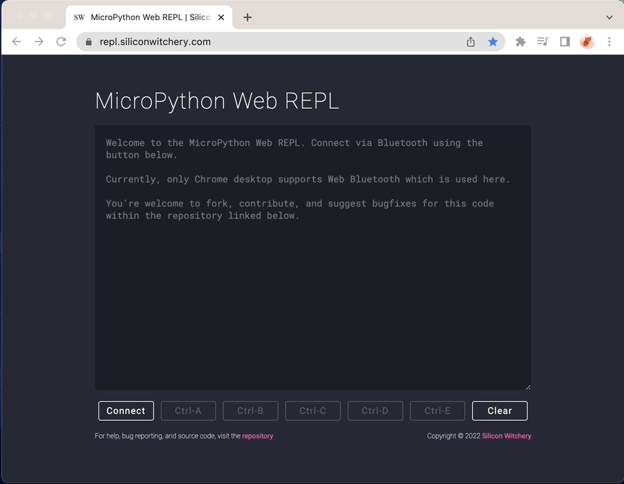

# Web Bluetooth based MicroPython REPL 

For use with Bluetooth enabled devices, including the [S1 Module](https://www.siliconwitchery.com/module).

This REPL terminal works slightly different from most. Rather than sending characters or control codes individually, the full line is buffered and sent as a single payload. This greatly improves throughput and power consumption on your device.

Typically terminals work on a character by character basis. Pressing a key on your keyboard would issue that character to the device, and then the device would echo back what you pressed to print out onto your terminal. This includes control characters such as arrow keys, backspace and even things like color codes. The idea being that the end device always determines what should be printed. Something which is especially important for things like tab completion, and scrolling though history.

To achieve this functionality, we've implemented some tricks to work with all the control codes needed, while still allowing for convenient text editing shortcuts from within a modern browser. You can do things such as jump around words, select, copy-paste, and clear the text box without the need for these commands to be specifically supported on the device. Everything is buffered in the text area, and when you're ready to send, just hit enter.

The only caveat is that *currently* only large MTU devices are supported.

## Currently supported features
- Connecting over BLE via the Nordic UART service
- All REPL modes including raw, friendly and paste
- Switching between modes using Ctrl-A to Ctrl-E
- Auto indentation
- Tab suggestions and autocomplete

## Planned improvements
- Detecting MTU size and sending data as appropriately sized chunks
- Improvements to how paste mode works